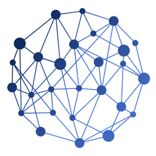
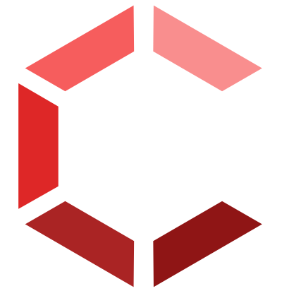
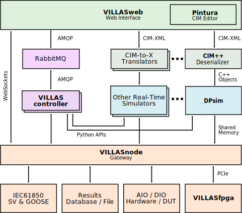

# VILLASframework

VILLAS is framework for coupling test beds and real-time simulators between geographically distributed laboratories.
The development of VILLAS is mainly driven by RWTH Aachen University and was originally designed here for geographically distributed real-time simulation of electrical networks, but can also be used without restrictions for simulation in other domains as well as multi-physical systems.

The framework consists of several independent components, which can be combined according to requirements and needed functions.

Central is _VILLASnode_ as interface for the coupling between the involved components.
It enables real-time data exchange via various protocols and data formats.

In addition, _VILLASweb_ provides a web-based user interface with which scenarios, user groups, laboratory infrastructure and measurement results can be managed.
The execution of experiments can be monitored and controlled by means of a freely programmable virtual control room.
For this purpose, real-time data can be transferred directly to the web-based control room via the _VILLASnode_ interface.

The configuration, inventory and control of the involved laboratory infrastructure is realized via the _VILLAScontroller_, which exchanges the current status as well as control commands and configurations between the virtual control room and the laboratory infrastructure.

The modular structure of the framework allows easy extensibility with new interfaces, protocols and data formats.
This is supported by the open development approach, which makes the framework fully available as open source software under the Apache 2.0 license to external users, allowing them to collaborate on the common code base.

VILLAS can therefore be used as a manufacturer-independent tool for coupling various components and has already been in use for several years at approx. 29 universities and research institutions (https://villas.fein-aachen.org/docs/users).
The efficiency of VILLASframework was already proven in several national, as well as international research projects.
Further publications on the VILLASframework are available at https://villas.fein-aachen.org/docs/publications.

It is actively developed by the [Institute for Automation of Complex Power Systems](https://www.acs.eonerc.rwth-aachen.de).

Funding is provided by the following research projects:

- [RESERVE](http://re-serve.eu/): European Unions Horizon 2020 research and innovation programme under grant agreement No 727481.
- [VILLAS](https://villas.fein-aachen.org/website/): Funding provided by [JARA-ENERGY](http://www.jara.org/en/research/energy). Jülich-Aachen Research Alliance (JARA) is an initiative of RWTH Aachen University and Forschungszentrum Jülich.
- [Urban Energy Lab 4.0](http://www.acs.eonerc.rwth-aachen.de/go/id/qxvw): Funding is provided by the [European Regional Development Fund (EFRE)](https://ec.europa.eu/regional_policy/en/funding/erdf/).

## Components

VILLASframework consists of several components:

-  [VILLASnode](https://github.com/VILLASframework/node)
-  [VILLASfpga](https://github.com/VILLASframework/fpga)
-  [VILLASweb](https://github.com/VILLASframework/web)
-  [VILLAScontroller](https://github.com/VILLASframework/controller)

## Architecture

## Documentation

We provide user documentation on this website:
[https://villas.fein-aachen.org/docs](https://villas.fein-aachen.org/docs).

For further question please consider joining our Slack channel: [FEIN Aachen e.V. Slack](https://join.slack.com/t/feinev/shared_invite/enQtNTE1NjY5MTg5NTY4LWM4MWI5ZTVkNDgzZTgyNmY5NWY2N2M3MjdjYzQxY2E0MmRlNjBkYTc3ODNlMDliY2M5YzllNjE4YTY3ODBjM2M).

## Publications

**We kindly ask acadmic users of our tools to cite the following paper in their own publications:**

  
Click here to show list of publications.

- A. Monti et al., "[A Global Real-Time Superlab: Enabling High Penetration of Power Electronics in the Electric Grid](https://ieeexplore.ieee.org/document/8458285/)," in _IEEE Power Electronics Magazine_, vol. 5, no. 3, pp. 35-44, Sept. 2018.
- M. Stevic, S. Vogel and A. Monti, "[From Monolithic to Geographically Distributed Simulation of HVdc Systems](https://ieeexplore.ieee.org/document/8460045)," _2018 IEEE 19th Workshop on Control and Modeling for Power Electronics (COMPEL)_, Padova, Italy, 2018, pp. 1-5.
- M. Mirz, S. Vogel, B. Schäfer, A. Monti, "Distributed Real-Time Co-Simulation as a Service," _2018 IEEE International Conference on Industrial Electronics for Sustainable Energy Systems (IESES)_, Waikato, NZ, Jan. 2018.
- S. Vogel, M. Mirz, L. Razik and A. Monti, "[An Open Solution for Next-generation Real-time Power System Simulation](https://ieeexplore.ieee.org/document/8245739)," _2017 IEEE Conference on Energy Internet and Energy System Integration (EI2)_, Beijing, 2017, pp. 1-6.
- M. Stevic et al., “[A Multi-Site European Framework for Real-Time Co-Simulation of Power Systems](http://digital-library.theiet.org/content/journals/10.1049/iet-gtd.2016.1576),” _IET Generation, Transmission & Distribution_, Jun. 2017.
- M. Stevic, M. Panwar, M. Mohanpurkar, R. Hovsapian and A. Monti, "[Empirical study of simulation fidelity in geographically distributed real-time simulations](https://ieeexplore.ieee.org/document/8107236)," _2017 North American Power Symposium (NAPS)_, Morgantown, WV, 2017, pp. 1-6.
- C. F. Covrig et al., [A European Platform for Distributed Real Time Modelling & Simulation of Emerging Electricity Systems](https://ec.europa.eu/jrc/en/publication/european-platform-distributed-real-time-modelling-simulation-emerging-electricity-systems). _European Union: JRC Science Hub_, 2016.
- E. Bompard et al., “[A multi-site real-time co-simulation platform for the testing of control strategies of distributed storage and V2G in distribution networks](http://ieeexplore.ieee.org/document/7695666/),” in _18th European Conference on Power Electronics and Applications_ (EPE’16 ECCE Europe), 2016, pp. 1–9.
- M. Stevic et al., “[Virtual integration of laboratories over long distance for real-time co-simulation of power systems](http://ieeexplore.ieee.org/document/7793422/),” in _IECON 2016 - 42nd Annual Conference of the IEEE Industrial Electronics Society_, 2016, pp. 6717–6721.
- M. Stevic, S. Vogel, A. Monti, and S. D’Arco, “[Feasibility of geographically distributed real-time simulation of HVDC system interconnected with AC networks](http://ieeexplore.ieee.org/document/7232700/),” in _PowerTech_, 2015 IEEE Eindhoven, 2015, pp. 1–5.
- M. Stevic, A. Monti and A. Benigni, "[Development of a simulator-to-simulator interface for geographically distributed simulation of power systems in real time](https://ieeexplore.ieee.org/document/7392888)," _IECON 2015 - 41st Annual Conference of the IEEE Industrial Electronics Society_, Yokohama, 2015, pp. 005020-005025.
- M. Stevic and S. Vogel, “[Geographically Distributed Simulation: a backbone platform for studying integration of offshore wind energy](http://www.marinet2.eu/wp-content/uploads/2017/04/DistSimOffshoreWind_SINTEF_infrastructure_access_report.pdf),” MARINET Infrastructure Access Rep., Dec. 2014.

## Slides

- [VILLAS concept](https://villas.fein-aachen.org/slides/VILLASconcept_AMonti.pdf)
  (_ERIGrid - VILLAS workshop, 13th September 2018, OFFIS Oldenburg_)
- [VILLASframework Applications](https://villas.fein-aachen.org/slides/VILLASframework_Applications_MStevic.pdf.pdf)
  (_ERIGrid - VILLAS workshop, 13th September 2018, OFFIS Oldenburg_)
- [VILLASframework](https://villas.fein-aachen.org/slides/VILLASframework-v5.pdf)
  (_ERIGrid - VILLAS workshop, 13th September 2018, OFFIS Oldenburg_)
- [Co-simulation interfaces for connecting distributed real-time simulators](https://villas.fein-aachen.org/slides/Co-sim_interfaces_RT16.pdf)
   (_RT16 - OPAL-RT User Conference - Steffen Vogel - 7th June 2016 - Munich, Germany_)
- "An open solution for next-generation real-time power system simulation", 2017 IEEE Conference on Energy Internet and Energy System Integration (EI2), Beijing, 2017
  - [Poster](https://villas.fein-aachen.org/slides/ieee_ei2_2017_poster_open_solution.pdf)
  - [Slides](https://villas.fein-aachen.org/slides/3-minute-presentation-797.pdf)

## Contact / Mailing list

The project is using a public [mailing list](https://mailman.rwth-aachen.de/mailman/listinfo/villas) for announcements.
Please click on the link above to subscribe.

For further question please consider joining our Slack channel: [FEIN Aachen e.V. Slack](https://join.slack.com/t/feinev/shared_invite/enQtNTE1NjY5MTg5NTY4LWM4MWI5ZTVkNDgzZTgyNmY5NWY2N2M3MjdjYzQxY2E0MmRlNjBkYTc3ODNlMDliY2M5YzllNjE4YTY3ODBjM2M).

Steffen Vogel (<post@steffenvogel.de>) is coordinating development of VILLASframework and its application in project at ACS.

[Institute for Automation of Complex Power Systems (ACS)](http://www.acs.eonerc.rwth-aachen.de)
[EON Energy Research Center (EONERC)](http://www.eonerc.rwth-aachen.de)
[RWTH University Aachen, Germany](http://www.rwth-aachen.de)
